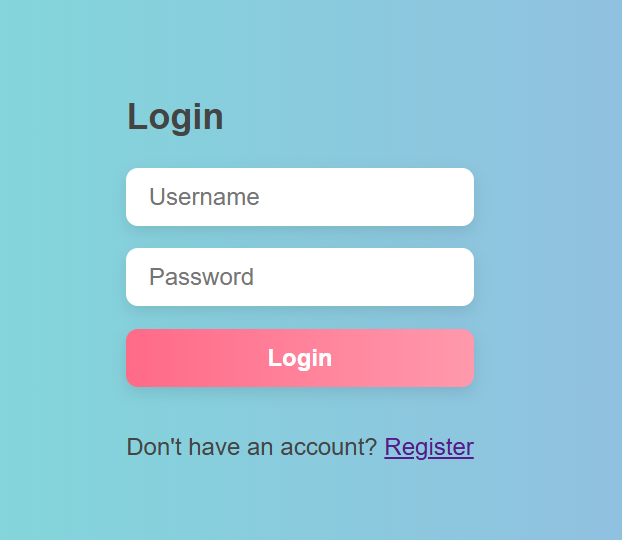
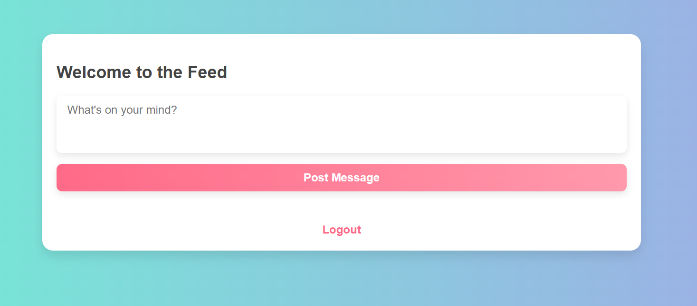
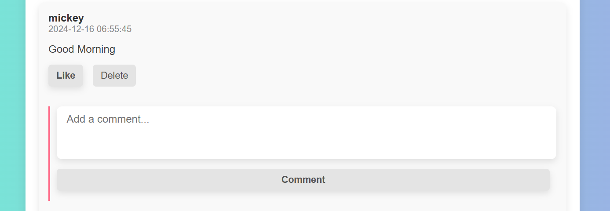

# Django Feed Application
This project is a Django-based feed application designed to mimic the functionality of a Facebook News Feed. It allows users to create messages, comment on posts, like posts and comments, and manage their own posts using CRUD operations.

# Features
1. User Authentication

- Integrated login and registration functionality.
- Users must log in or register to access the feed.

2. Feed Page

- Displays all messages posted by users.
- Allows users to create new posts.

3. Messaging Functionality

- Users can post messages visible to all other users.

4. Comments

- Users can comment on any post.
- Comments are stored in a separate database table.

5. CRUD Operations

- Users can delete their own messages.

6. Likes

- Users can like or unlike posts and comments.
- Displays the number of likes for each post and comment.

# Folder Structure

project/
│
├── feed/
│   ├── migrations/
│   ├── templates/
│   │   ├── feed.html
│   │   ├── login.html
│   │   ├── register.html
│   ├── admin.py
│   ├── apps.py
│   ├── models.py
│   ├── views.py
│   ├── urls.py
 
│
├── users/
│   ├── templates/
│   │   ├── login.html
│   │   └── register.html
│   ├── admin.py
│   ├── apps.py
│   ├── forms.py
│   ├── models.py
│   ├── views.py
│   ├── urls.py
│
├── project/
│   ├── settings.py
│   ├── urls.py
│   ├── wsgi.py
│   ├── asgi.py
│
├── manage.py
├── static/
│   │   ├── css/
│   │   │   └── styles.css
├── requirements.txt
└── README.md

# Access the Application

Registration: http://127.0.0.1:8000/users/register/  
Login: http://127.0.0.1:8000/users/login/ 
Feed: http://127.0.0.1:8000/feed/ 

# Installing From requirements.txt
pip install -r requirements.txt